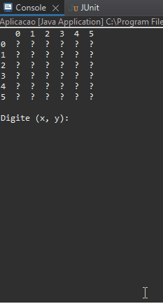
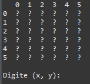
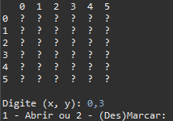
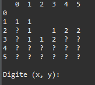

# Campo Minado em Java

Pequeno projeto em JAVA baseado em um jogo bem conhecido para usuário Windows das antigas, utilizando como base de estudo os principais conceitos de programação orientado a objetos e funções lambdas, assim como testes utilizando JUnit e com espaço para eventuais atualizações futuras. 💫

 💥 Campo Minado em Java 💥 

 <a href="#Conteúdo">Projeto</a>
 |
 <a href="#Tecnologias estudadas">Tecnologias</a>
 |
 <a href="# Como abrir o projeto">Instalação</a>
 |
 <a href="# Projetos semelhantes">Autor</a>

<h2 align="center">

# Projeto
O projeto foi criado a partir do curso da Cod3r que trouxe um grande aprendizado conhecimento e desenvolvimento utilizando o Java e suas APIs criando vários projetos de estudo, um dos primeiros projetos foi o jogo campo minados, que utiliza diversos conceitos de programação orientada a objetetos, funções e testes.

 <h1 align="center">
    
</h1>

# Tecnologias

  
 

 

# Instalação ✨

Para abrir o projeto instale em seu computador o <a src="https://www.java.com/pt-BR/download/ie_manual.jsp?locale=pt_BR"> Java </a> e o <a src="https://www.oracle.com/java/technologies/downloads/"> Java JDK </a>, eu utilizei a IDE <a src="https://www.eclipse.org/downloads/"> Eclipse </a> para fazer os projetos mas você pode utilizar qualquer outra.

### 1. Passo para começar

Abra o terminal ou a interface de linha de comando da sua escolha.

### 2. Clone o projeto

~~~bash 
git clone https://github.com/yuryshadow/campo-minado-java.git 
~~~

### 3. Utilize a sua IDE de escolha para abrir os arquivos.

 

# Manual

1) Para jogar o campo minado é bem simples, separe com "," a linha e a coluna que deseja fazer alguma alteração (abrir, marcar).

 

    

2) Selecione 1 para abrir o jogo ou 2 para marcar se acha que tem alguma mina no local.

 

    

Após selecionar a ação o sinal de "?" irá mudar utilizando as regras do jogo minado.

    

Caso você não saiba as regras do campo minado é só clicar no link abaixo: 
<a href="https://pt.wikipedia.org/wiki/Campo_minado#:~:text=8%20Liga%C3%A7%C3%B5es%20externas-,Regras,mina%2C%20ent%C3%A3o%20o%20jogo%20acaba."> > Regras do campo minado </a>

 

# Projetos semelhantes

<a href="https://github.com/yuryshadow/Aprendizado-Java/edit/main/README.md"> 1. Aprendizado Java </a>
 

#

Made with 🖥️ by YURI CARLOS ✌️ <a href="https://www.linkedin.com/in/yurisouza/">See my LinkedIn </a>

